# Documentación Técnica del Sistema de Gestión - Ley de Enfriamiento de Newton

## Tabla de Contenidos

1. [Introducción](#introducción)
2. [Arquitectura del Sistema](#arquitectura-del-sistema)
3. [Formulación Matemática](#formulación-matemática)
4. [Estructura del Código](#estructura-del-código)
5. [Módulo de Cálculos](#módulo-de-cálculos)
6. [Aplicación Web](#aplicación-web)
7. [Flujo de Datos](#flujo-de-datos)
8. [Referencias](#referencias)

---

## Introducción

Este sistema implementa una aplicación web interactiva para modelar y analizar el proceso de enfriamiento de objetos metálicos utilizando la **Ley de Enfriamiento de Newton**. El sistema está diseñado alrededor de un caso de estudio específico de la industria manufacturera, pero puede adaptarse a cualquier problema de enfriamiento.

### Caso de Estudio Principal

El sistema está centrado en el siguiente problema real:

**Problema:** Un bloque de acero con dimensiones de **10 cm × 10 cm × 2 cm** es retirado de un horno industrial a una temperatura de **300°C**. Inmediatamente se coloca en un ambiente con temperatura constante de **20°C** para su enfriamiento. Después de **5 minutos**, se mide que la temperatura del bloque ha descendido a **200°C**.

**Contexto Industrial:** Este tipo de situación es común en procesos de manufactura como el tratamiento térmico de metales, donde es fundamental controlar la velocidad de enfriamiento para garantizar propiedades mecánicas específicas. El control preciso del enfriamiento es crítico para:
- Evitar deformaciones y tensiones internas
- Garantizar la dureza y resistencia adecuadas
- Optimizar los tiempos de producción
- Asegurar la calidad del producto final

**Parámetros del Caso de Estudio:**
- Temperatura inicial: $T_0 = 300°C$
- Temperatura ambiente: $T_a = 20°C$
- Temperatura medida a los 5 minutos: $T(5) = 200°C$
- Constante de enfriamiento calculada: $k \approx 0.088367$ min⁻¹

Estos valores son los valores por defecto en la aplicación, pero el sistema permite trabajar con cualquier conjunto de parámetros.

### Módulos del Sistema

El sistema está compuesto por dos módulos principales:

- **`newton_cooling_calculator.py`**: Módulo de cálculo matemático que implementa las ecuaciones diferenciales
- **`app.py`**: Aplicación web interactiva construida con Streamlit

### Objetivo del Sistema

El sistema permite:
- Calcular la temperatura del bloque de acero en función del tiempo
- Visualizar gráficamente el proceso de enfriamiento
- Verificar soluciones explícitas e implícitas de la ecuación diferencial
- Calcular la constante de enfriamiento a partir de datos experimentales (como en el caso de estudio)
- Generar tablas de resultados y análisis detallados para procesos industriales

---

## Arquitectura del Sistema

### Diagrama de Arquitectura General

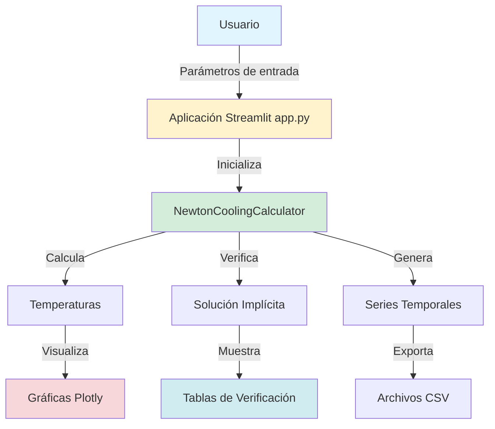

### Componentes Principales

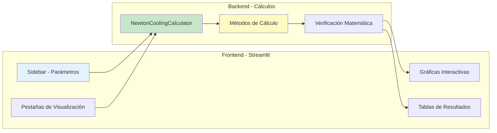

---

## Formulación Matemática

### Ecuación Diferencial

La Ley de Enfriamiento de Newton establece que la velocidad de cambio de la temperatura de un objeto es directamente proporcional a la diferencia entre su temperatura instantánea y la temperatura del medio ambiente:

$$
\frac{dT}{dt} = -k(T - T_a)
$$

**Donde:**
- $T(t)$: Temperatura del objeto en el instante $t$ (°C)
- $T_a$: Temperatura ambiente (constante) (°C)
- $k > 0$: Constante de enfriamiento (min⁻¹)
- El signo negativo indica que la temperatura disminuye cuando $T > T_a$

### Solución Explícita

Resolviendo la ecuación diferencial por separación de variables:

$$
\frac{dT}{T - T_a} = -k \, dt
$$

Integrando ambos lados:

$$
\int \frac{dT}{T - T_a} = -k \int dt
$$

$$
\ln|T - T_a| = -kt + C_1
$$

Aplicando exponencial y condiciones iniciales $T(0) = T_0$:

$$
T(t) = T_a + (T_0 - T_a) e^{-kt}
$$

### Solución Implícita

La solución también puede expresarse en forma implícita:

$$
\ln|T - T_a| + kt = C
$$

Donde $C = \ln|T_0 - T_a|$ es una constante determinada por las condiciones iniciales.

**Verificación:** Derivando implícitamente respecto al tiempo:

$$
\frac{1}{T - T_a} \cdot \frac{dT}{dt} + k = 0
$$

$$
\frac{dT}{dt} = -k(T - T_a)
$$

Recuperamos la ecuación diferencial original, confirmando la validez de la solución.

### Razón de Enfriamiento

La velocidad de cambio de temperatura (razón de enfriamiento) es:

$$
\frac{dT}{dt} = -k(T - T_a)
$$

Esta razón es máxima al inicio cuando la diferencia de temperatura es mayor, y disminuye exponencialmente a medida que el objeto se acerca a la temperatura ambiente.

### Cálculo de la Constante k desde Datos Experimentales

Si conocemos la temperatura medida $T_{medida}$ en un tiempo específico $t$, podemos calcular $k$ a partir de la solución explícita.

**Partiendo de la solución explícita:**
$$
T(t) = T_a + (T_0 - T_a) e^{-kt}
$$

**Proceso de despeje paso a paso:**

1. Restamos $T_a$ en ambos lados:
$$
T(t) - T_a = (T_0 - T_a) e^{-kt}
$$

2. Dividimos ambos lados por $(T_0 - T_a)$:
$$
\frac{T(t) - T_a}{T_0 - T_a} = e^{-kt}
$$

3. Aplicamos logaritmo natural en ambos lados:
$$
\ln\left(\frac{T(t) - T_a}{T_0 - T_a}\right) = \ln(e^{-kt}) = -kt
$$

4. Despejamos $k$ multiplicando por $-1$ y dividiendo por $t$:
$$
k = -\frac{1}{t} \ln\left(\frac{T(t) - T_a}{T_0 - T_a}\right)
$$

5. Aplicando propiedades de logaritmos para simplificar:
$$
k = \frac{1}{t} \ln\left(\frac{T_0 - T_a}{T(t) - T_a}\right)
$$

**Fórmula final:**
$$
k = \frac{1}{t} \ln\left(\frac{T_0 - T_a}{T_{medida} - T_a}\right)
$$

Donde:
- $T_0$: Temperatura inicial
- $T_a$: Temperatura ambiente
- $T_{medida}$: Temperatura medida en el tiempo $t$
- $t$: Tiempo transcurrido desde el inicio

#### Ejemplo: Caso de Estudio del Bloque de Acero

Para el caso de estudio específico:
- Temperatura inicial: $T_0 = 300°C$
- Temperatura ambiente: $T_a = 20°C$
- Temperatura medida a los 5 minutos: $T(5) = 200°C$

Aplicando la fórmula de cálculo de $k$:

$$
k = \frac{1}{t} \ln\left(\frac{T_0 - T_a}{T_{medida} - T_a}\right)
$$

Sustituyendo los valores:

$$
k = \frac{1}{5} \ln\left(\frac{300 - 20}{200 - 20}\right) = \frac{1}{5} \ln\left(\frac{280}{180}\right) = \frac{1}{5} \ln(1.5556)
$$

Calculando el logaritmo:

$$
k = \frac{1}{5} \times 0.4418 \approx 0.088367 \text{ min}^{-1}
$$

Esta es la constante de enfriamiento que caracteriza el comportamiento térmico del bloque de acero en estas condiciones específicas. Esta constante depende de:
- Las propiedades térmicas del material (acero)
- Las dimensiones del bloque (10 cm × 10 cm × 2 cm)
- Las condiciones del ambiente (temperatura, humedad, movimiento del aire)
- El mecanismo de transferencia de calor predominante (conducción, convección, radiación)

---

## Estructura del Código

### Diagrama de Clases

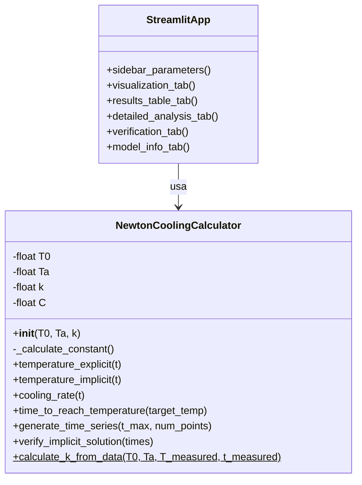

### Flujo de Ejecución Principal

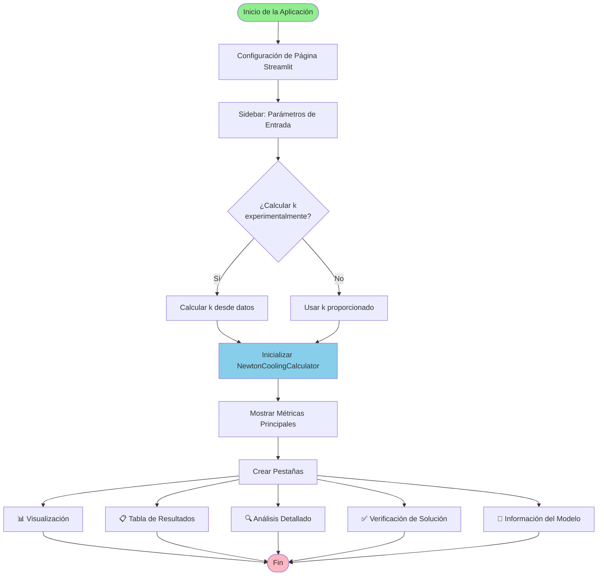

---

## Módulo de Cálculos

### Archivo: `newton_cooling_calculator.py`

Este módulo contiene la clase `NewtonCoolingCalculator` que implementa toda la lógica matemática del sistema.

#### Clase: `NewtonCoolingCalculator`

**Propósito:** Encapsula todos los cálculos relacionados con la Ley de Enfriamiento de Newton.

##### Atributos de Instancia

```python
T0: float    # Temperatura inicial del objeto (°C)
Ta: float    # Temperatura ambiente (°C)
k: float     # Constante de enfriamiento (min⁻¹)
C: float     # Constante de la solución implícita
```

##### Métodos Principales

###### 1. `__init__(self, T0, Ta, k)`

**Propósito:** Inicializa la calculadora con los parámetros del problema.

**Parámetros:**
- `T0`: Temperatura inicial del objeto (°C)
- `Ta`: Temperatura ambiente (°C)
- `k`: Constante de enfriamiento (min⁻¹)

**Proceso:**
1. Almacena los parámetros
2. Calcula automáticamente la constante C usando `_calculate_constant()`

**Ejemplo:**
```python
calculator = NewtonCoolingCalculator(T0=300, Ta=20, k=0.088367)
# C se calcula automáticamente: C = ln|300 - 20| = ln(280) ≈ 5.634790
```

###### 2. `_calculate_constant(self)`

**Propósito:** Calcula la constante C de la solución implícita.

**Fórmula:** $C = \ln|T_0 - T_a|$

**Retorna:** Valor de la constante C

**Implementación:**
```python
def _calculate_constant(self):
    return np.log(abs(self.T0 - self.Ta))
```

**Ejemplo:**
- Si $T_0 = 300°C$ y $T_a = 20°C$
- $C = \ln|300 - 20| = \ln(280) \approx 5.634790$

###### 3. `temperature_explicit(self, t)`

**Propósito:** Calcula la temperatura del objeto en un tiempo específico usando la solución explícita.

**Fórmula:** $T(t) = T_a + (T_0 - T_a) e^{-kt}$

**Parámetros:**
- `t`: Tiempo en minutos

**Retorna:** Temperatura en °C

**Implementación:**
```python
def temperature_explicit(self, t):
    return self.Ta + (self.T0 - self.Ta) * np.exp(-self.k * t)
```

**Ejemplo:**
```python
# Para t = 10 minutos
T = calculator.temperature_explicit(10)
# T = 20 + (300 - 20) * exp(-0.088367 * 10)
# T ≈ 135.71°C
```

**Gráfico del Comportamiento:**

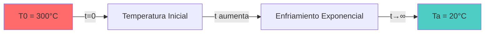

###### 4. `temperature_implicit(self, t)`

**Propósito:** Verifica la solución implícita calculando el valor de la expresión $\ln|T - T_a| + kt$.

**Fórmula:** $\ln|T - T_a| + kt$ (debe ser igual a C)

**Parámetros:**
- `t`: Tiempo en minutos

**Retorna:** Valor de la expresión implícita (debe ser igual a C)

**Implementación:**
```python
def temperature_implicit(self, t):
    T = self.temperature_explicit(t)
    return np.log(abs(T - self.Ta)) + self.k * t
```

**Uso:** Este método se utiliza para verificar que la solución es correcta. Si todos los valores calculados son aproximadamente iguales a C, la solución es válida.

**Ejemplo:**
```python
# Para diferentes tiempos, el valor debe ser constante
t1 = calculator.temperature_implicit(0)   # ≈ 5.634790
t2 = calculator.temperature_implicit(5)    # ≈ 5.634790
t3 = calculator.temperature_implicit(10)  # ≈ 5.634790
# Todos los valores son iguales (o muy cercanos) a C
```

###### 5. `cooling_rate(self, t)`

**Propósito:** Calcula la razón de enfriamiento (velocidad de cambio de temperatura) en un tiempo específico.

**Fórmula:** $\frac{dT}{dt} = -k(T - T_a)$

**Parámetros:**
- `t`: Tiempo en minutos

**Retorna:** Razón de enfriamiento en °C/min (valor negativo porque la temperatura disminuye)

**Implementación:**
```python
def cooling_rate(self, t):
    T = self.temperature_explicit(t)
    return -self.k * (T - self.Ta)
```

**Ejemplo:**
```python
# En t = 0 minutos
rate = calculator.cooling_rate(0)
# rate = -0.088367 * (300 - 20) = -24.74 °C/min
# El objeto se enfría a 24.74°C por minuto inicialmente

# En t = 10 minutos
rate = calculator.cooling_rate(10)
# rate = -0.088367 * (135.71 - 20) ≈ -10.23 °C/min
# La razón de enfriamiento ha disminuido
```

**Comportamiento de la Razón de Enfriamiento:**

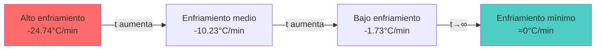

###### 6. `time_to_reach_temperature(self, target_temp)`

**Propósito:** Calcula el tiempo necesario para que el objeto alcance una temperatura objetivo.

**Fórmula:** $t = \frac{1}{k} \ln\left(\frac{T_0 - T_a}{T_{objetivo} - T_a}\right)$

**Parámetros:**
- `target_temp`: Temperatura objetivo (°C)
- `tolerance`: Tolerancia para la convergencia (por defecto 0.01)

**Retorna:** Tiempo en minutos, o `None` si no es alcanzable

**Implementación:**
```python
def time_to_reach_temperature(self, target_temp, tolerance=0.01):
    if abs(target_temp - self.Ta) < tolerance:
        return None  # Nunca alcanzará exactamente la temperatura ambiente
    
    if (target_temp > self.T0 > self.Ta) or (target_temp < self.T0 < self.Ta):
        return None  # La temperatura objetivo está en dirección opuesta
    
    t = (1 / self.k) * np.ln(abs((self.T0 - self.Ta) / (target_temp - self.Ta)))
    return max(0, t)
```

**Ejemplo:**
```python
# ¿Cuánto tiempo tarda en llegar a 100°C?
time = calculator.time_to_reach_temperature(100)
# time = (1/0.088367) * ln((300-20)/(100-20))
# time ≈ 13.87 minutos
```

###### 7. `generate_time_series(self, t_max, num_points)`

**Propósito:** Genera una serie temporal de temperaturas para visualización.

**Parámetros:**
- `t_max`: Tiempo máximo en minutos
- `num_points`: Número de puntos a generar (por defecto 100)

**Retorna:** Tupla `(tiempos, temperaturas)` donde ambos son arrays de NumPy

**Implementación:**
```python
def generate_time_series(self, t_max, num_points=100):
    times = np.linspace(0, t_max, num_points)
    temperatures = [self.temperature_explicit(t) for t in times]
    return times, np.array(temperatures)
```

**Uso:** Este método se utiliza para generar datos para las gráficas.

**Ejemplo:**
```python
times, temperatures = calculator.generate_time_series(t_max=60, num_points=200)
# Genera 200 puntos desde t=0 hasta t=60 minutos
# Retorna arrays con los tiempos y temperaturas correspondientes
```

###### 8. `verify_implicit_solution(self, times)`

**Propósito:** Verifica que la solución implícita se mantiene constante para múltiples valores de tiempo.

**Parámetros:**
- `times`: Array de tiempos para verificar

**Retorna:** Array de valores de la expresión implícita (deben ser aproximadamente iguales a C)

**Implementación:**
```python
def verify_implicit_solution(self, times):
    return [self.temperature_implicit(t) for t in times]
```

**Uso:** Se utiliza para verificar matemáticamente que la solución es correcta.

**Ejemplo:**
```python
times = np.linspace(0, 60, 20)
values = calculator.verify_implicit_solution(times)
# Todos los valores en 'values' deberían ser aproximadamente iguales a C
# Si hay diferencias grandes, hay un error en los cálculos
```

###### 9. `calculate_k_from_data(T0, Ta, T_measured, t_measured)` (Método Estático)

**Propósito:** Calcula la constante de enfriamiento k a partir de datos experimentales.

**Fórmula:** $k = \frac{1}{t} \ln\left(\frac{T_0 - T_a}{T_{medida} - T_a}\right)$

**Parámetros:**
- `T0`: Temperatura inicial (°C)
- `Ta`: Temperatura ambiente (°C)
- `T_measured`: Temperatura medida en tiempo t_measured (°C)
- `t_measured`: Tiempo de la medición (min)

**Retorna:** Constante k (min⁻¹)

**Implementación:**
```python
@staticmethod
def calculate_k_from_data(T0, Ta, T_measured, t_measured):
    if abs(T_measured - Ta) < 1e-10:
        raise ValueError("La temperatura medida es muy cercana a la temperatura ambiente")
    
    k = (1 / t_measured) * np.log(abs((T0 - Ta) / (T_measured - Ta)))
    return k
```

**Ejemplo:**
```python
# Si medimos que a los 5 minutos la temperatura es 200°C
k = NewtonCoolingCalculator.calculate_k_from_data(
    T0=300, Ta=20, T_measured=200, t_measured=5
)
# k = (1/5) * ln((300-20)/(200-20))
# k ≈ 0.088367 min⁻¹
```

---

## Aplicación Web

### Archivo: `app.py`

Este archivo contiene la aplicación web interactiva construida con Streamlit.

### Estructura de la Aplicación

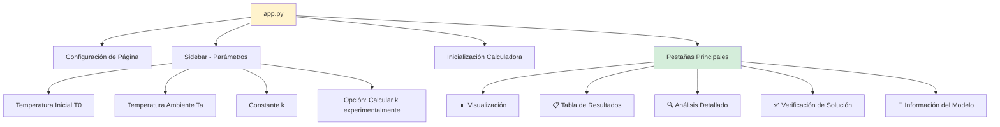

### Componentes Principales

#### 1. Configuración Inicial

```python
st.set_page_config(
    page_title="Ley de Enfriamiento de Newton",
    page_icon="🌡️",
    layout="wide",
    initial_sidebar_state="expanded"
)
```

**Propósito:** Configura la página de Streamlit con título, icono y layout.

#### 2. Sidebar - Parámetros de Entrada

El sidebar permite al usuario ingresar los parámetros del modelo:

- **Temperatura Inicial (T₀)**: Rango -50°C a 1000°C, valor por defecto 300°C
- **Temperatura Ambiente (Tₐ)**: Rango -50°C a 100°C, valor por defecto 20°C
- **Constante k**: Rango 0.001 a 1.0 min⁻¹, valor por defecto 0.088367 min⁻¹
- **Opción experimental**: Permite calcular k desde datos experimentales

**Flujo de Cálculo de k Experimental:**

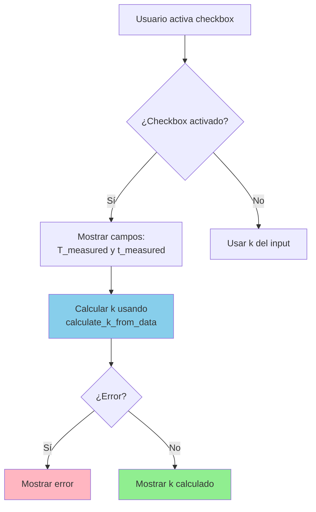

#### 3. Métricas Principales

Se muestran cuatro métricas clave:
- Temperatura Inicial
- Temperatura Ambiente
- Constante k
- Constante C (calculada automáticamente)

#### 4. Pestañas de la Aplicación

##### Pestaña 1: 📊 Visualización

**Componentes:**
- Slider para tiempo máximo (10-200 minutos)
- Gráfica de temperatura vs tiempo
- Gráfica de razón de enfriamiento vs tiempo
- Línea de referencia para temperatura ambiente

**Proceso de Generación de Gráficas:**

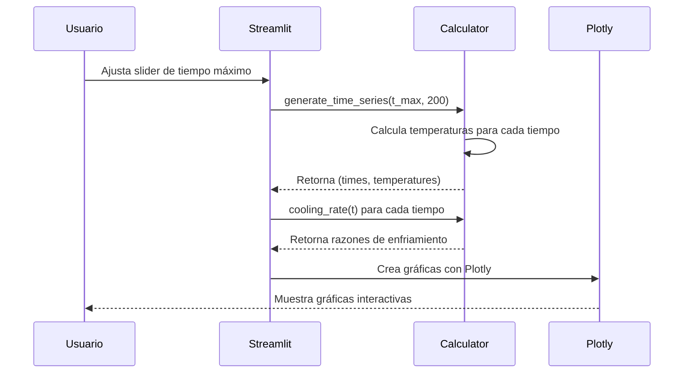

**Código Clave:**
```python
times, temperatures = calculator.generate_time_series(t_max, 200)
cooling_rates = [calculator.cooling_rate(t) for t in times]

# Crear gráfica con subplots
fig = make_subplots(
    rows=2, cols=1,
    subplot_titles=("Temperatura vs Tiempo", "Razón de Enfriamiento vs Tiempo"),
    vertical_spacing=0.1,
    row_heights=[0.6, 0.4]
)
```

##### Pestaña 2: 📋 Tabla de Resultados

**Componentes:**
- Sliders para número de puntos y tiempo máximo
- Explicación visual antes de la tabla
- Tabla con columnas:
  - Tiempo (min)
  - Temperatura (°C)
  - Razón de Enfriamiento (°C/min)
  - Solución Implícita: ln|T-Ta| + kt
- Botón de descarga CSV

**Proceso de Generación de Tabla:**

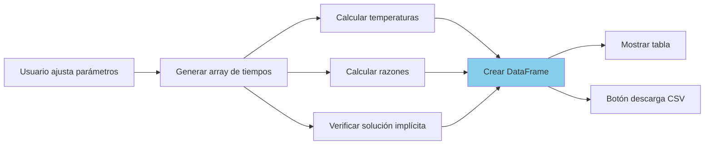

##### Pestaña 3: 🔍 Análisis Detallado

**Componentes:**
- **Columna 1**: Temperatura en tiempo específico
  - Input para tiempo específico
  - Muestra temperatura, razón de enfriamiento, diferencia con ambiente
  
- **Columna 2**: Tiempo para alcanzar temperatura objetivo
  - Input para temperatura objetivo
  - Calcula tiempo requerido
  - Verificación del resultado

- **Tiempos Característicos**:
  - Tiempo para reducir diferencia a la mitad
  - Tiempo para alcanzar 90% del equilibrio
  - Vida media térmica: $t_{1/2} = \frac{\ln(2)}{k}$

**Cálculo de Tiempos Característicos:**

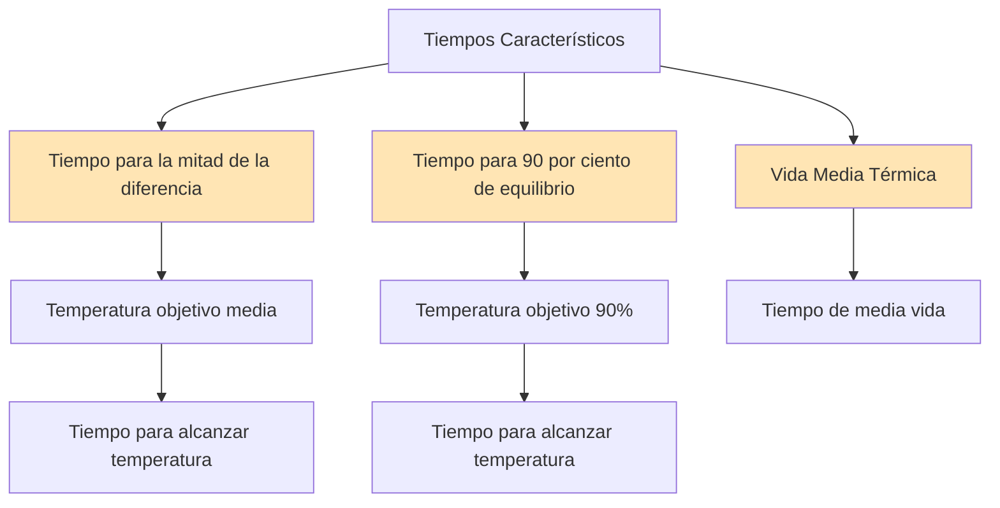

##### Pestaña 4: ✅ Verificación de Solución

**Componentes:**
- Explicación detallada de la solución implícita
- Gráfica de verificación (debe ser una línea horizontal)
- Tabla de verificación detallada con:
  - Tiempo
  - Temperatura T
  - Diferencia |T - Ta|
  - ln|T - Ta| + kt (debe ser constante)
  - Constante C esperada
  - Diferencia con C
- Estadísticas de verificación

**Proceso de Verificación:**

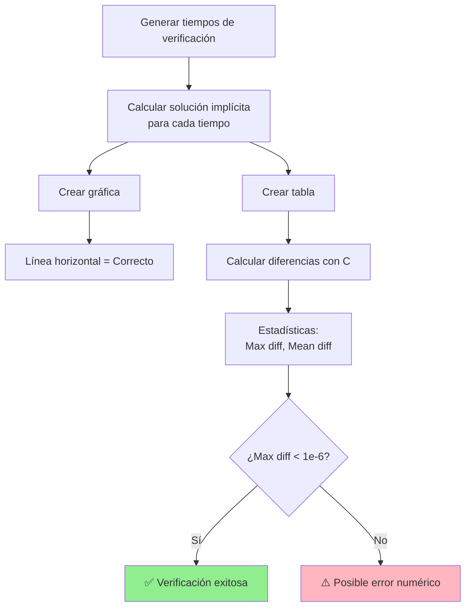

##### Pestaña 5: 📖 Información del Modelo

**Contenido:**
- Ecuación diferencial
- Solución explícita
- Solución implícita con explicación detallada
- Propiedades del modelo
- Aplicaciones
- Limitaciones
- Ecuaciones con valores actuales

---

## Flujo de Datos

### Flujo Completo del Sistema

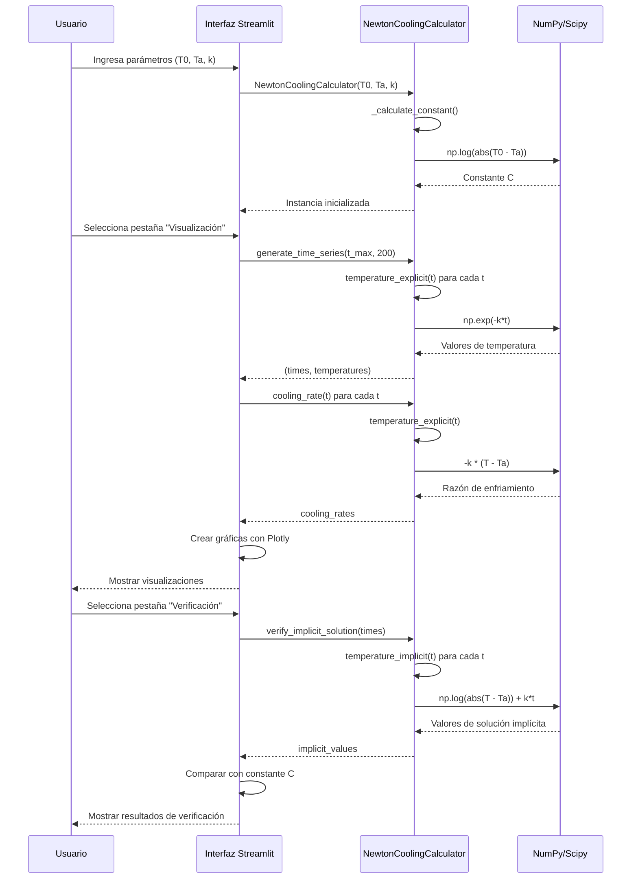

### Flujo de Cálculo de Temperatura

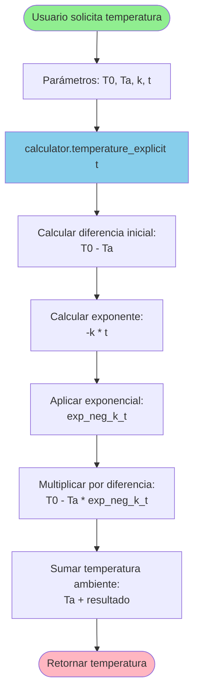

---

## Diagramas Adicionales

### Diagrama de Estados del Objeto

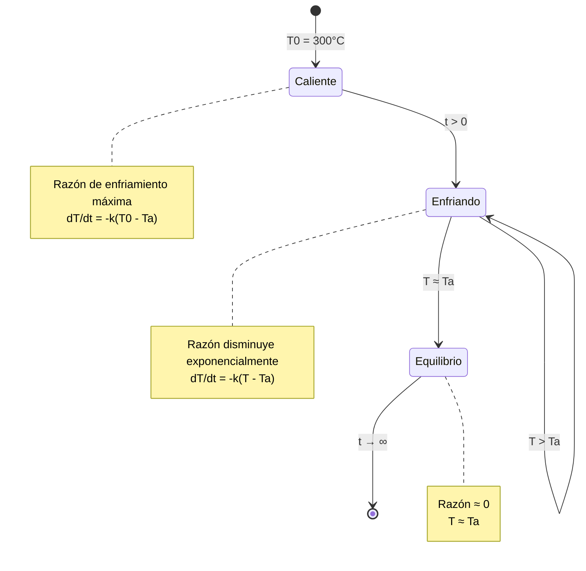

### Relación entre Variables

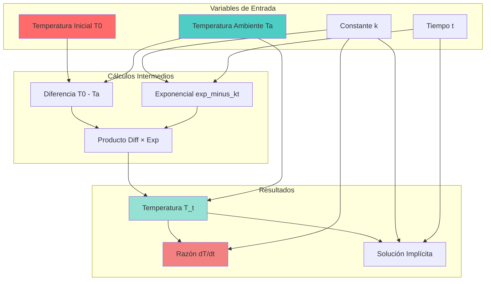

---

## Referencias

### Bibliografía Matemática

1. **Ecuaciones Diferenciales Ordinarias**: La ecuación diferencial $\frac{dT}{dt} = -k(T - T_a)$ es una EDO de primer orden, lineal y homogénea.

2. **Método de Separación de Variables**: Utilizado para resolver la ecuación diferencial.

3. **Verificación por Derivación Implícita**: Método para confirmar que la solución implícita satisface la ecuación diferencial original.

### Librerías Utilizadas

- **NumPy**: Cálculos numéricos (logaritmos, exponenciales, arrays)
- **SciPy**: Optimización y funciones científicas
- **Streamlit**: Framework para aplicaciones web interactivas
- **Plotly**: Visualización de gráficas interactivas
- **Pandas**: Manipulación de datos y tablas

### Enlaces Útiles

- [Documentación de Streamlit](https://docs.streamlit.io/)
- [Documentación de NumPy](https://numpy.org/doc/)
- [Documentación de Plotly](https://plotly.com/python/)
- [Ley de Enfriamiento de Newton - Wikipedia](https://es.wikipedia.org/wiki/Ley_del_enfriamiento_de_Newton)

---
